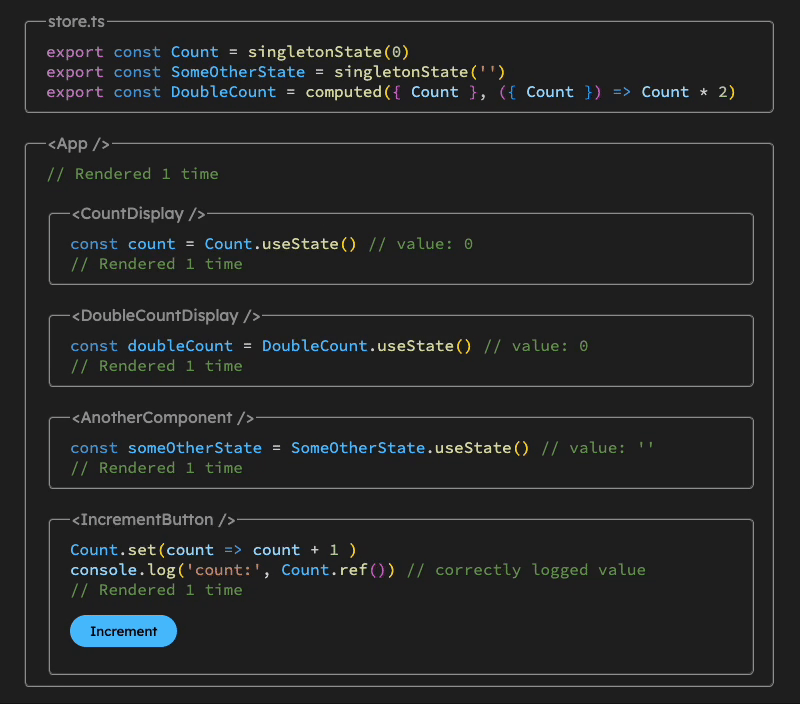

# Singleton State

A 1kB alternative to React Context with improved performance and ergonomics.

## Define your state

Every piece of state is a hook. Create state using `singletonState`.

```ts
import { singletonState } from 'singletonstate'

export const useCount = singletonState(0)
```

## Use your state

Just import and use the hook in your components, no providers needed.

```ts
function Display() {
  const [count] = useCount()
  return <h1>{count}</h1>
}

function Increment() {
  const [count, setCount] = useCount()
  return <button onClick={() => setCount(count + 1)}>Increment</button>
}
```

## Performance benefits?

React Context causes all consumers of the context to re-render every time the value changes. Commonly there will be multiple values in the same context like so:

```ts
export const Context = createContext<{
  count: number
  setCount: Dispatch<SetStateAction<number>>
  someOtherState: string
}>(null!)
```

This will mean that any subscribers of `someOtherState` will get a re-render every time `count` changes, unless we wrap our app with a new provider for every piece of state.


With Singleton State, each piece of state will be separated into its own hook, so there will be no unnecessary re-renders.




